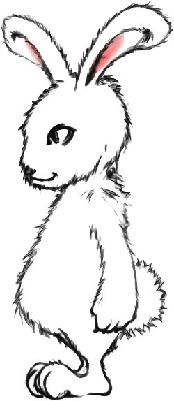

# Rabbit

subtitle
:   Markdownでプレゼンテーション

author
:   須藤功平

institution
:   COZMIXNG

theme
:   rabbit

# Rabbit

プレゼンテーションツール

* 実装: Ruby/GTK+ 2/cairo
* 動作: PC-UNIX/Win/Mac
* 書式:
  Wiki/RD/Markdown/PDF
* 見た目: Ruby

# 機能: 表示（1）

* *強調*
* ソースの色付け

# 機能: 表示（2）

* 表
* おもしろテーマ
* 画像
  * 対応フォーマット多数
  * PNG/JPEG/.../PDF/EPS/SVG

# 機能: 表示（3）

* 長い行の折り畳み
* ソースの色付け
* 大きな文字

# 機能: UI（1）

* 豊富なキーバインド
* 右クリックメニュー
* マウスジェスチャ
* スポットライト
* 虫眼鏡

# 機能: UI（2）

* 一覧ページ
* 落書き
* 国際化
* スライド内検索

# 機能: UI（3）

* ホワイト・ブラックアウト
  * スライド白塗り・黒塗り
* ラビットホール
  * スライドに穴
* 持ち時間の残りを視覚化
  * うさぎとかめ

# 機能: 入力

* ファイル
* 標準入力
* HTTP
* Hiki/RWiki
* SlideShare

# 機能: 入力書式

* Wiki（Hiki）
* RD
* Markdown (kramdown)
* PDF
  * →PDFビューア

# 機能: 出力

* 画像
* 画像 + HTML
* PS/PDF
* 印刷用PS/PDF
  * nスライド/ページ

# 機能: 外部API

* HTTP
* dRuby
* XML-RPC
* SOAP

# 機能: 作成支援

* ソースの自動再読み込み
* テーマの再読み込み
* テーマの切り替え

# ToDo

* インラインでの画像表示
* リンク先へのジャンプ
* サウンド
* ビデオ
* 3D

# 画像

{:width='100' height='100'}

# 画像: 鏡面反射

{:relative_height='80' reflect_ratio='0.5'}

# 画像: 背景（1）

* 背景画像
* デフォルトはセンタリング

## プロパティ

background-image
:   lavie.png

background-image-relative-width
:   50

{::comment}
background-image-align
:   right

background-image-relative-margin-right
:   3
{:/comment}

# 画像: 背景（2）

{:relative_width="30" align="right" relative_margin_right="-5"}

* 右寄せ背景画像
* スライド内で指定
  * \{:align="right"\}

# 画像サイズ

スライドサイズに応じて変更可能

{:caption="兎" relative_height="50"}

# 外部画像

URL先の画像をダウンロード

# 数式

* 書式: TeX
* バックエンド
  * LaTeX

# LaTeX

$$
$f(x)=\displaystyle\int_{-\infty}^x~e^{-t^2}dt$

\LaTeX
$$

# EPS

事前にEPSで作成

{:relative_width="80"}

# SVG

{:relative_height="100"}

# Dia

{:relative_width="90"}

# GIMP

{:relative_height="100"}

# 折り返し

なーーーーーーーーーーーーーーーーーーーーーーーーーーーーーがーーーーーーーーーーーーーーーーーーーーーーーーーーーーーーーーーーーーーい行は？

# ソース

以下がソース

    # comment
    def method_name
      body
    end

以上がソース

# ソース: 色付き

以下がソース

    # comment
    def method_name
      body
    end
{: lang="ruby"}

以上がソース

# 引用

> You take the ''red pill'', you stay in Wonderland and 
> I show you how deep the ''rabbit-hole'' goes.

# 箇条書き

* レベル1-1
  * レベル2-1
    * レベル3-1
    * レベル3-2
  * レベル2-2
* レベル1-2

# ラベル付きリスト

Rabbit
:   うさぎ

    Tortoise
    :   かめ

うさぎ
:   Rabbit

# 表

| みだし1 | みだし2 |
|---------|--------|
| 内容1 | 内容2 |
| 長ーーーーーい内容3 | 長ーーーーーーーーーーーーーーーーーーい内容4 |

# 操作: 移動

次ページ
:   次に進みそうなキー/左クリック
    n, f, j, l, Spc, Ret, +, ↓, →

前ページ
:   前に進みそうなキー/中クリック
    p, b, k, h, BS, Del, -, ↑, ←

# 操作: 高度な移動

タイトルページへ移動
:   a, 0, <, Home

nページ目へ移動
:   1-9, +Ctrl=+10, +Alt=+20

最後のページへ移動
:   e, $, >, End

# 操作: 本番用（1）

フルスクリーン切替え
:   F5, F10, F11, ジェスチャ↓↑

一覧モード切替え
:   i

一覧モードからページ移動
:   ダブルクリック

# 操作: 本番用（2）

キャッシュ作成
:   c

情報ウィンドウ表示切替え
:   I

# 操作: 本番用（3）

虫眼鏡
:   Ctrl+右クリック
    ホイールで拡大率変更

スポットライト
:   ダブル右クリック
    ホイールで半径変更

# 操作: 本番用（4）

落書き
:   ポップアップ（右クリック）→
    落書きモード

マウスジェスチャー
:   右ドラッグ

# 操作: 本番用（5）

ホワイトアウト
:   W

ブラックアウト
:   B

# 操作: 保存

スクリーンショット
:   各ページを画像として保存
    s

印刷
:   各ページをPS/PDFとして保存
    Ctrl+p

# 操作: 描画

再描画
:   Ctrl+l

テーマ再読み込み
:   t, r

スライドの調整値をリセット
:   Alt+a

# 操作: 穴

穴を広げる
:   E

穴を狭める
:   N

# 操作: 検索

次を検索
:   C-s, /

前を検索
:   C-r, ?

検索終了
:   C-g

# 操作: 終了

終了
:   q, Escape

アイコン化
:   z

# まとめ

* プレゼンテーションツール
* マルチプラットフォーム
* 機能/UI: 高機能/ユニーク
* キーボード重視
  * UI・テキストベースのソース
